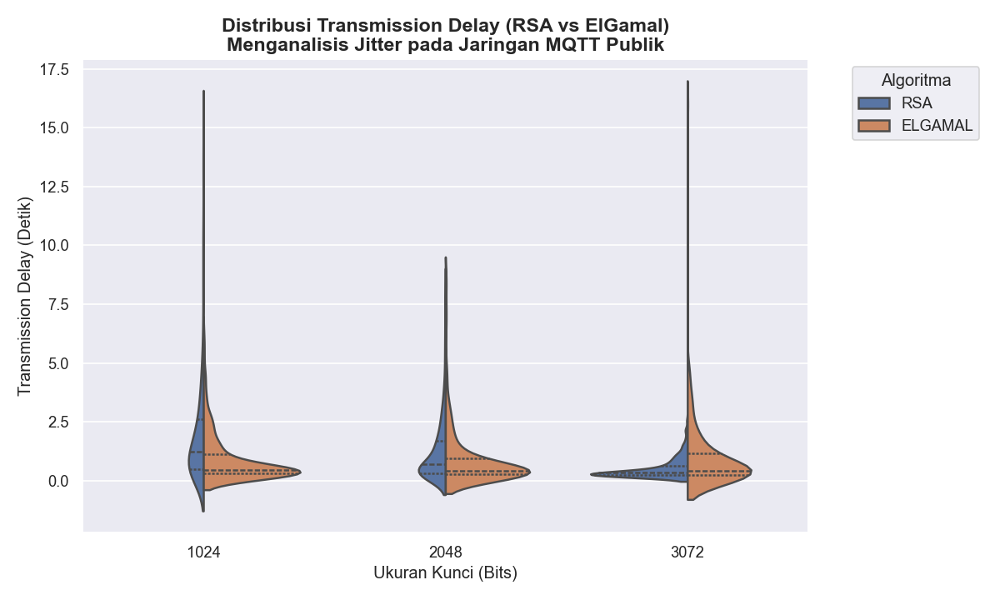
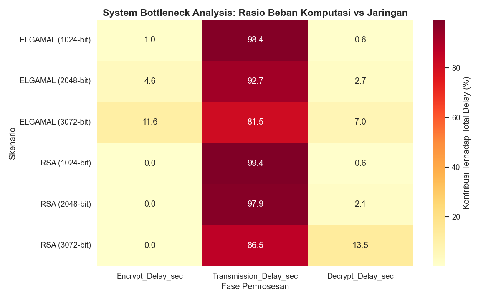
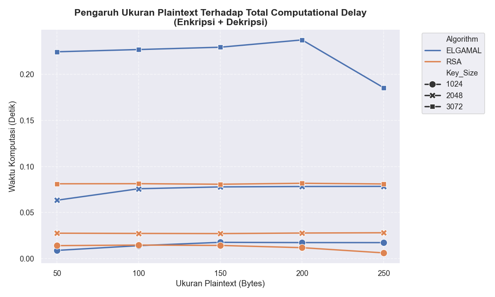
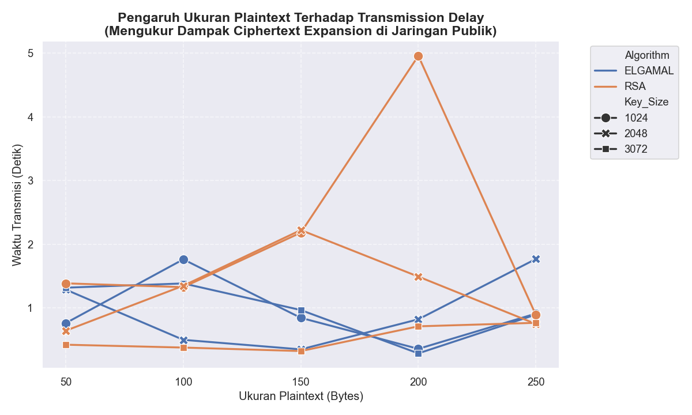

# Performance Evaluation of MQTT Protection: RSA vs ElGamal

Sebuah arsitektur pengujian performa keamanan (Security Performance Benchmarking) pada protokol komunikasi IoT (MQTT) yang membandingkan efisiensi algoritma kriptografi asimetris **RSA** dan **ElGamal**.

## Deskripsi Eksperimen

Proyek ini mengimplementasikan perlindungan data secara _End-to-End Encryption_ (E2EE) menggunakan RSA dan ElGamal yang dikirimkan melalui broker publik **HiveMQ Cloud** dengan proteksi lapisan transport (TLS Port 8883).

Sistem mengevaluasi secara otomatis dua metrik utama berdasarkan variasi ukuran kunci (1024, 2048, 3072 bit) dan ukuran _plaintext_ (50 hingga 250 bytes) dari 100 sampel pengujian:

1. **Computational Delay:** Waktu yang dihabiskan _node_ untuk proses enkripsi (sisi Publisher) dan dekripsi (sisi Subscriber).
2. **Transmission Delay:** Waktu tempuh _ciphertext_ dari titik pengiriman hingga diterima oleh _Subscriber_ melewati jaringan publik internet.

## Hasil Evaluasi

Berdasarkan ekstraksi data dari 3.000 sampel pengiriman pesan, diperoleh ringkasan rata-rata performa sebagai berikut:

| Algoritma   | Ukuran Kunci | Rata-rata Enkripsi (s) | Rata-rata Dekripsi (s) | Total Komputasi (s) | Rata-rata Transmisi (s) | Jitter Transmisi (s) |
| :---------- | :----------- | :--------------------- | :--------------------- | :------------------ | :---------------------- | :------------------- |
| **ELGAMAL** | 1024-bit     | 0.009456               | 0.005660               | 0.015117            | 0.926975                | 1.036684             |
| **ELGAMAL** | 2048-bit     | 0.047094               | 0.027700               | 0.074793            | 0.944609                | 1.323472             |
| **ELGAMAL** | 3072-bit     | 0.137987               | 0.082819               | 0.220806            | 0.969697                | 1.459647             |
| **RSA**     | 1024-bit     | 0.000218               | 0.012049               | 0.012266            | 2.147856                | 2.598993             |
| **RSA**     | 2048-bit     | 0.000138               | 0.027482               | 0.027619            | 1.290368                | 1.402236             |
| **RSA**     | 3072-bit     | 0.000146               | 0.081117               | 0.081263            | 0.519723                | 0.420885             |

### Insight

1. **Dominasi Efisiensi _Edge Device_ (RSA):** RSA membuktikan keunggulannya untuk _node_ sensor IoT bertenaga rendah. Waktu enkripsi RSA nyaris menyentuh 0.0001 detik, sementara ElGamal 3072-bit memicu _bottleneck_ komputasi di sisi pengirim (hingga 0.13 detik per pesan).
2. **Distribusi Beban Sistem:** Analisis _heatmap_ menunjukkan bahwa RSA secara cerdas memindahkan beban pemrosesan ke jaringan dan _Subscriber_ (fase dekripsi), menjadikannya ideal untuk arsitektur IoT di mana _server backend_ memiliki spesifikasi perangkat keras yang jauh lebih mumpuni.
3. **Anomali Jitter Jaringan Publik:** Waktu transmisi didominasi oleh fluktuasi latensi (_jitter_) rute internet menuju Cloud Broker Eropa dan _overhead_ TLS, bukan sekadar ukuran _ciphertext_. Hal ini tervalidasi dari lonjakan transmisi RSA 1024-bit yang dipengaruhi murni oleh kepadatan antrean jaringan publik saat pengujian berlangsung.

---

### Visualisasi Data Eksperimen

**1. Analisis Distribusi Transmission Delay (Jitter)** 

**2. System Bottleneck Analysis (Rasio Beban)** 

**3. Pengaruh Ukuran Plaintext Terhadap Computational Delay** 

**4. Pengaruh Ukuran Plaintext Terhadap Transmission Delay** 

---

## Struktur Repositori

- `config.py` : File konfigurasi terpusat (kredensial broker, ukuran _payload_, parameter eksperimen).
- `crypto_utils.py` : Pustaka inti (_core library_) yang menangani logika enkripsi/dekripsi.
- `Publisher.py` & `Subscriber.py` : Skrip simulasi _node_ IoT terdistribusi.
- `EDA.ipynb` : _Jupyter Notebook_ untuk analisis dan visualisasi data.
- `requirements.txt` : Daftar dependensi pustaka Python.

## Cara Menjalankan (_How to Run_)

**1. Persiapan Lingkungan**

```bash
pip install -r requirements.txt
```

2. Menjalankan Node Subscriber (Terminal 1)

```Bash
python Subscriber.py
```

3. Menjalankan Node Publisher (Terminal 2)

```Bash
python Publisher.py
```

Catatan: Sistem menggunakan pengiriman asinkron dengan jeda waktu untuk menghindari pemblokiran batas koneksi dari server HiveMQ.
